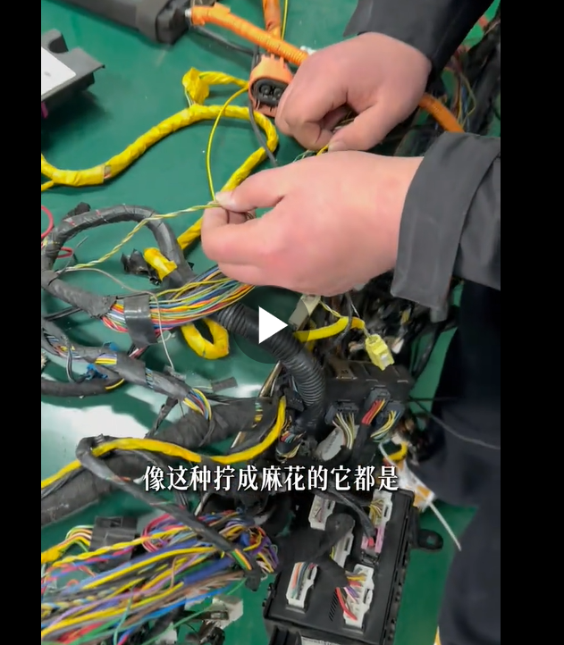
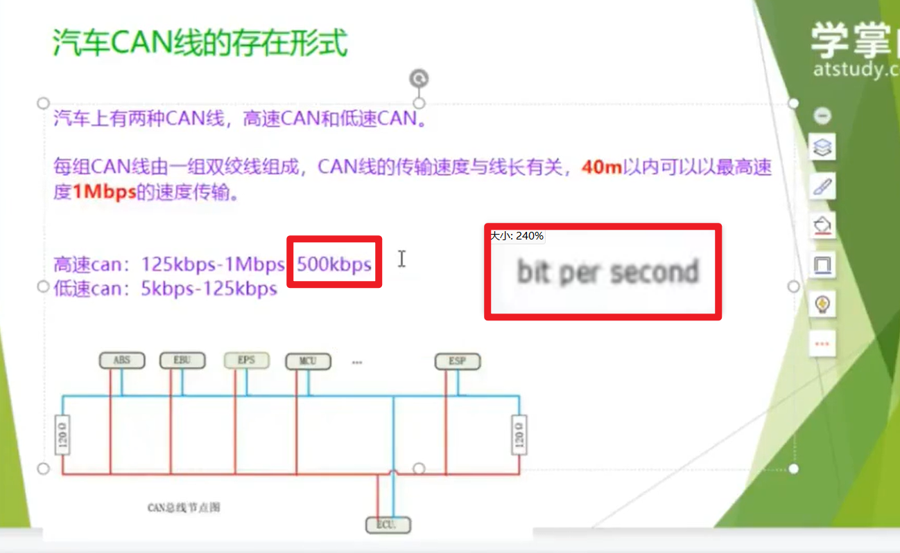

## can线形状 辨别
- **CAN**：动力、底盘、智驾、BMS、VCU、ABS，模块之间对等双向通信。
- **LIN**：车门、雨刮、座椅、空调风门、小灯光；主模块下发指令给下游执行器，单主多从，低速，坏了一般不影响整车启动。

## 传输速率 波特率
高速CAN：125Kbps、250Kbps、500Kbps、1Mbps，常用500Kbps，1Mbps用于动力总成。
高速CAN 通常是500Kbps，低速CAN 通常是125Kbps。

lin线：常是100Kbps。

